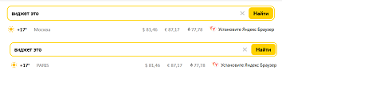
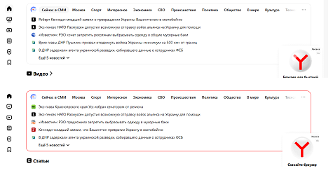
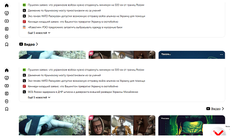

Урок 1. Веб-технологии: вчера, сегодня, завтра

сдаем либо как md файл и через ваш гитхаб
либо как html страничка с набором доп файлов, сдавать как архив.

Задача: на основе сайта yandex.ru:
- Определите, на каком протоколе работает сайт.
- Проанализируйте структуру страницы сайта.
- Внесите не менее 10 изменений на страницу с помощью инструмента разработчика и представьте скриншоты было/стало.
- Задание по желанию необязательное - Создайте прототип низкой детализации (дополнительное задание, если на семинаре дошли до задания №8).image.png

1. Сайт ya.ru работает на протоколе https:
Это [ссылка на сайт yandex](https://yandex.ru/ "yandex.ru") 

2. Структура страницы сайта:
• Шапка (head)
• Зона контента (content - body)
• Подвала (footer) нет

**Внесите не менее 10 изменений на страницу:**
1. изменен фон поисковой строки
 
 
2. изменен город

3. изменен цвет текста (Сейчас в СМИ)
  
 
4. изменен цвет рамки зоны контента
  
 
5. изменена форма рамки зоны контента
  
 
6. увеличен отступ у зоны контента 
  

7. изменен тип списка на круги
 

8. изменен цвет фона на красный
  
 
9. Изменен текст раздела (СОВСЕМ НЕ Видео)
  
 
10. изменен шрифт и расположение раздела Видео
  

